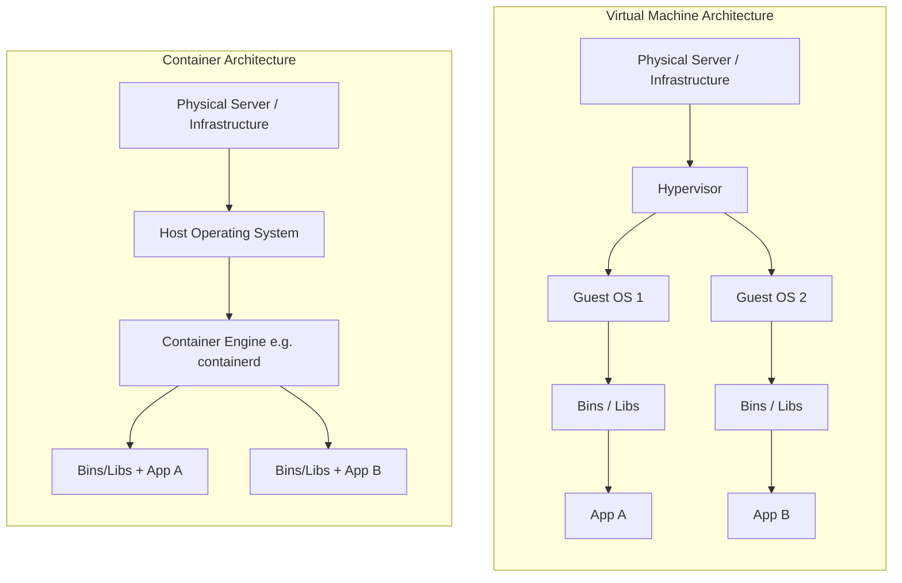

# ☁️ 01: Containers vs. Virtual Machines (VMs)

> **Source Topic:** 4. What is a container and how is it different from a VM?
> **Role Context:** Senior AKS Platform Architect / SRE

## 1️⃣ The "Why" (Analogy)
Think of a **Virtual Machine (VM)** like buying your own plot of land and building an entire isolated house. You have to install your own plumbing, electricity, and foundation (the Guest OS). It is highly isolated but very heavy and slow to build.

A **Container** is like renting an apartment in a high-rise building. You share the underlying plumbing, electricity, and foundation (the Host OS Kernel) with the other tenants, but you have your own locked room. Because you don't have to build the foundational infrastructure every time, moving in is almost instant, and the footprint is incredibly lightweight.

---

## 2️⃣ Architecture Diagram
*The fundamental abstraction layer difference that enables high-density Kubernetes deployments.*



---

## 3️⃣ Execution Commands
While this fundamentally happens beneath AKS, understanding the local workflow is critical for debugging node-level issues.

```bash
# Verify the underlying container runtime on an AKS node (AKS uses containerd, not docker)
kubectl get nodes -o wide

# Native Docker command to demonstrate isolation (Testing a lightweight app locally)
docker run -d --name nginx-test -p 8080:80 nginx:alpine

# Reviewing the resource footprint of a container vs VM
# Containers only utilize the exact memory of the application process.
docker stats
```

---

## 4️⃣ Production Gotchas & Cost Optimization
*   **⚠️ The Shared Kernel Trap:** Because containers share the Host OS kernel, a kernel panic or a critical kernel vulnerability (like Dirty COW) will instantly compromise or crash *all* containers on that node. VMs do not share a kernel.
*   **💰 Cost Density:** You can easily pack 50+ Microservice containers onto a single `Standard_D2s_v5` Azure VM node because they avoid the 2GB+ RAM overhead of running 50 separate Windows/Linux Guest OS layers.

---

## 5️⃣ Interview Traps (STAR)

**Question:** *"We have a highly regulated workload that processes financial data. The security team is worried about running it on a shared AKS cluster with other applications. How do you address their container isolation concerns?"*

*   **Situation:** The infosec team raised red flags that standard Kubernetes containers only offer logical (cgroup/namespace) isolation, inherently sharing the host kernel which exposes a risk for financial workloads.
*   **Task:** Architect a solution within AKS that provides VM-level hardware isolation while maintaining the Kubernetes container orchestration workflow.
*   **Action:** I would implement **Kata Containers** (via Azure Linux with hypervisor isolation) or deploy a dedicated **AKS system node pool** using node taints/tolerations coupled with `NetworkPolicies` to ensure the financial pods run on physically isolated, dedicated VMs that share no kernel space with other apps.
*   **Result:** The security team signed off on the architecture because it successfully bridged the lightweight deployment cycle of containers with the hardened hypervisor-level security boundary of VMs.
