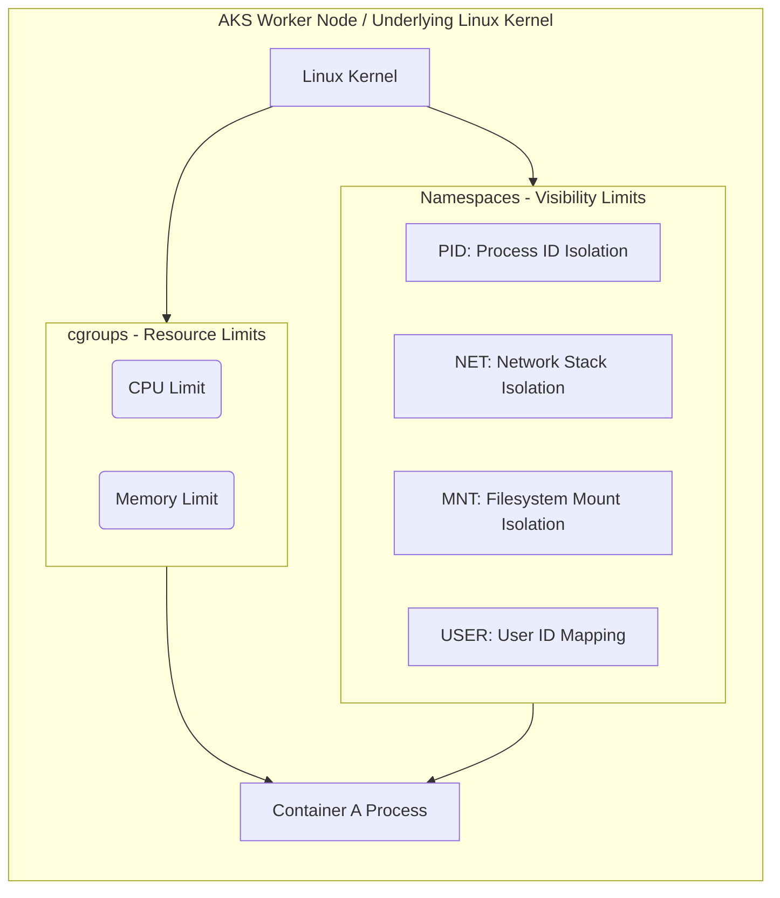

# ☁️ 02: Deep Dive into Container Isolation (Namespaces & Cgroups)

> **Source Topic:** What is a container and how is it different from a VM?
> **Role Context:** Senior AKS Platform Architect / SRE

## 1️⃣ The "Why" (Analogy)
When deploying a VM, isolation is handled at the **Hardware layer** by the Hypervisor allocating literal CPU cores and RAM limits. 

A Container doesn't have a hypervisor. Instead, it relies on two core Linux kernel features to pretend it is isolated: **Namespaces** and **Cgroups**.
*   **Namespaces (The Blinders):** Imagine putting a worker in a cubicle where they cannot see or hear anyone else in the office. They think they are alone in the building. Namespaces isolate what a container can *see* (Network, Mounts, Users, Processes).
*   **cgroups (The Budget):** Imagine giving that same worker a strict budget of exactly 1 pen and 500 sheets of paper. Control Groups (cgroups) isolate what a container can *use* (CPU, RAM).

A container is not a discrete physical object; it is simply a standard Linux process wearing "namespace blinders" while operating on a "cgroup budget."

---

## 2️⃣ Mermaid Architecture Diagram
*The underlying Linux kernel isolation mechanisms replacing the Hypervisor.*



---

## 3️⃣ Execution Commands
While AKS abstracts this, understanding execution boundaries is key to writing secure deployments and debugging raw nodes.

```bash
# View the cgroups for a running pod to see hardware resource allocations
kubectl exec <pod-name> -- cat /proc/1/cgroup

# Validate the namespaces a container is currently running in
# E.g., showing IPC, MNT, PID, UTS, NET
ls -l /proc/$(kubectl exec <pod-name> -- awk '{print $1}')/ns

# Defensive Scripting:
# Never deploy a container requiring `hostNetwork: true` or `hostPID: true` 
# unless explicitly designed as a DaemonSet monitoring tool. Doing so breaks the NET/PID namespaces.
```

---

## 4️⃣ Production Gotchas & Cost Optimization
*   **User Namespace Vulnerability (root):** By default, if a container runs as `root` (UID 0), and an attacker escapes the container (e.g., Mount namespace exploit), they are `root` on the underlying AKS Node. You must configure `runAsNonRoot: true` in your pod's Security Context to utilize User Namespaces properly.
*   **Resource Leaks (cgroup misses):** If you deploy to AKS without specifying `requests` and `limits`, the container is placed in a "BestEffort" QoS class without strict cgroups. A single runaway container will drain the entire node's CPU, killing neighboring pods (Noisy Neighbor).

---

## 5️⃣ Interview Traps (STAR)

**Question:** *"We had an incident where one small microservice completely crashed an entire 16-core AKS worker node, taking down five other critical applications along with it. Explain mechanically how this is possible in Kubernetes if containers are supposed to be isolated, and how you would prevent it."*

*   **Situation:** A Junior Developer deployed a frontend pod that entered an infinite loop memory leak, causing the entire AKS node to go into a `NotReady` State and evicting adjacent, unrelated workloads.
*   **Task:** Identify the breach in container isolation mechanics and harden the cluster.
*   **Action:** I identified that the deployment lacked resource limits. Because containers are just Linux processes sharing the host kernel, skipping resource limits means Kubernetes never instructs the Linux kernel to apply `cgroup` memory boundaries for that process. As a result, the container consumed 100% of the underlying node RAM, freezing the kubelet. I immediately patched the deployment with explicit Memory configuration (`resources.limits.memory`) and implemented a namespace-wide `LimitRange` policy to enforce default `cgroups` on all future deployments.
*   **Result:** The memory leak occurred again the next week, but because the `cgroup` boundary was strictly enforced by the kernel, the single errant pod was instantly `OOMKilled` and restarted without impacting *any* adjacent applications on the node.
