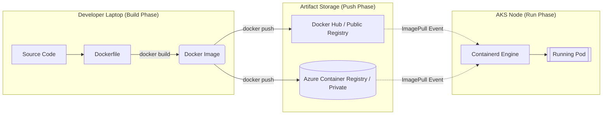

# ☁️ 04: Docker, Dockerfile, and Docker Hub

> **Source Topic:** 6. What are Docker, Dockerfile and Docker Hub?
> **Role Context:** Senior AKS Platform Architect / SRE

## 1️⃣ The "Why" (Analogy)
Imagine you want to start a global franchise of standardized coffee shops. 
*   **Dockerfile:** This is the *Architectural Blueprint* and the *Instruction Manual*. It dictates exactly what goes into the shop (espresso machines, chairs, paint color). 
*   **Docker Image:** This is the *Prefabricated Shop* sitting in a warehouse. It has been built perfectly to spec according to the blueprint, but it isn't operational yet because it has no electricity or employees.
*   **Docker Hub (or Azure Container Registry):** This is the *Global Real Estate Catalog* where you store your prefabricated shops so anyone in the world can order an exact replica.
*   **Docker Container Engine:** This is the *General Contractor* on the ground (the server). It downloads the prefabricated shop from the catalog, places it on a plot of land, hooks up the electricity (CPU/RAM), and opens it for business as a running container!

---

## 2️⃣ Mermaid Architecture Diagram
*The modern CI/CD flow from the Developer's Laptop to the Container Registry.*



---

## 3️⃣ Execution Commands
While Kubernetes orchestrates containers, you must master the underlying Docker/Buildah mechanics to construct the images that AKS consumes.

```bash
# 1. Build an image based on the instructions inside the local 'Dockerfile'
docker build -t my-aks-app:v1.0.0 .

# 2. Tag the image for a specific Azure Container Registry (ACR) before pushing
# Format: <registry-login-server>/<repository>:<tag>
docker tag my-aks-app:v1.0.0 myorgacr.azurecr.io/my-aks-app:v1.0.0

# 3. Authenticate securely with ACR using the Azure CLI (Defensive approach avoiding raw passwords)
az acr login --name myorgacr

# 4. Push the prefabricated image to the registry so AKS can pull it
docker push myorgacr.azurecr.io/my-aks-app:v1.0.0
```

---

## 4️⃣ Production Gotchas & Cost Optimization
*   **⚠️ The Docker Hub Rate Limit Trap:** Anonymous users pulling from Docker Hub are limited to 100 pulls per 6 hours. If your AKS cluster autoscales (HPA) frequently and relies on Docker Hub, your scale-up will fail permanently with `ErrImagePull (TooManyRequests)` causing massive production outages. **Always mirror heavily used base images into Azure Container Registry (ACR).**
*   **💰 Image Bloat:** If your Dockerfile blindly runs `apt-get install` without cleaning up caches (`rm -rf /var/lib/apt/lists/*`), your image will bloat from 100MB to 1.5GB. When AKS scales an HPA event, pulling a 1.5GB image takes 40+ seconds over the network, rendering your emergency scaling useless. Use *Multi-Stage Builds*.

---

## 5️⃣ Interview Traps (STAR)

**Question:** *"We launched a major marketing campaign and our AKS cluster attempted to aggressively scale from 5 pods to 100 pods. However, all the new pods got stuck in an `ImagePullBackOff` state and the traffic was dropped. What likely happened and how do you prevent this architecturally?"*

*   **Situation:** During a high-traffic event requiring rapid Horizontal Pod Autoscaling (HPA), the AKS nodes repeatedly failed to start the new workloads.
*   **Task:** Diagnose the pullback state and stabilize the deployment infrastructure immediately.
*   **Action:** I identified through `kubectl describe pod` that the AKS nodes were being hit with HTTP 429 `TooManyRequests` errors from Docker Hub. Because the cluster lacked a private registry, 100 pods simultaneously tried to pull the `nginx:alpine` base image, violating Docker Hub's strict anonymous rate limits. I responded by immediately executing an `az acr import` command to pull the `nginx` image natively into our internal Azure Container Registry. I then patched the deployment YAML to point strictly to the `myacrog.azurecr.io` URI instead of Docker Hub.
*   **Result:** The remaining 95 pods deployed in under 6 seconds because Azure-native ACR pulls are unthrottled and localized to the Azure networking backbone, eliminating the public rate limit dependency once and for all.
