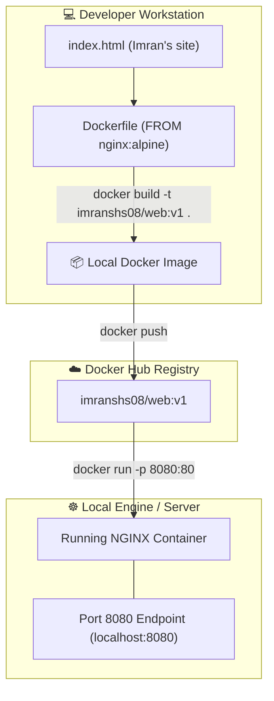

# ☁️ 05: Container Web App - Build, Run, and Push

> **Source Topic:** 7. Creating our first container app (web app), pushing it to Docker Hub and running
> **Role Context:** Senior AKS Platform Architect / SRE

## 1️⃣ The "Why" (Analogy)
Imagine opening a bakery (a web application). 
*   **The Ingredients (HTML):** This is the raw code (Imran's personal website data). 
*   **The Recipe (Dockerfile):** This tells the baker exactly how to combine the ingredients into a Cake.
*   **The Oven (`docker build`):** This is the process of baking the Cake into a solid, unchanging object (the Docker Image).
*   **The Display Window (`docker push`):** Putting the cake in the shop window (Docker Hub) so a delivery driver (AKS) can pick it up.
*   **Eating the Cake (`docker run`):** Serving the finished product to the end user on a plate connected to the dining room (Port 80 exposure).

---

## 2️⃣ Mermaid Architecture Diagram
*Lifecycle of an NGINX Web Server image from raw code to running container.*



---

## 3️⃣ Execution Commands
Below is the definitive defensive-scripting flowchart for building and releasing a high-availability container.

```bash
# 1. Create the workspace and raw HTML
mkdir -p my-web-app && cd my-web-app
echo "<h1>Welcome to Imran's AKS Masterclass Web App</h1>" > index.html

# 2. Write the declarative Dockerfile
cat <<EOF > Dockerfile
FROM nginx:alpine
COPY index.html /usr/share/nginx/html/index.html
EXPOSE 80
EOF

# 3. Build the Image
# ⚠️ Defensive: Never use the 'latest' tag. Always use semantic versioning (e.g. v1.0.0).
docker build -t imranshs08/aks-webapp:v1.0.0 .

# 4. Test Locally Before Pushing
# Map local port 8080 to container port 80. Run detached (-d).
docker run -d --name test-webapp -p 8080:80 imranshs08/aks-webapp:v1.0.0

# 5. Push to the Global Registry
# Ensures the AKS cluster can fetch it securely from anywhere.
docker login
docker push imranshs08/aks-webapp:v1.0.0
```

---

## 4️⃣ Production Gotchas & Cost Optimization
*   **⚠️ The `:latest` Tag Trap:** If you push your image as `imranshs08/aks-webapp:latest`, and Kubernetes is set to `imagePullPolicy: Always`, a pod restart will impulsively pull whatever the newest code is. If someone pushes broken code to `:latest`, an AKS node scale-up event will instantly pull the broken code and crash production. **Always use immutable tags (e.g., git commit SHAs or v1.0.1).**
*   **🛡️ Base Image Attack Surface:** In the Dockerfile, we used `nginx:alpine` instead of `nginx`. The default Nginx image is over 140MB and contains hundreds of background OS packages subject to CVE vulnerabilities. The Alpine variant is ~20MB, drastically shrinking the attack surface and saving massive Azure Egress bandwidth costs during node scale-outs.

---

## 5️⃣ Interview Traps (STAR)

**Question:** *"We had an incident where a developer hastily executed a `docker push` with a quick hotfix for a web app. Minutes later, the staging environment was fine, but production completely crashed when it autoscaled. What went wrong and how do you prevent it?"*

*   **Situation:** A developer patched a 502 error in the frontend HTML, built the image, and pushed it to Docker Hub using the `latest` tag out of habit. 
*   **Task:** Discover why the deployment broke production and enforce registry immutability.
*   **Action:** When the production AKS cluster experienced a load spike, the HPA (Horizontal Pod Autoscaler) spun up 3 new pods. Because the deployment manifest relied on `:latest`, the Kubelet bypassed the known-good cached image and queried Docker Hub, unintentionally pulling the developer's untested hotfix into production. The hotfix had a syntax error that panicked the frontend loop. I immediately rolled back the Deployment to the previous `ReplicaSet`, and instituted an **Image Immutability Policy** in Azure Container Registry (ACR), which outright rejects pushing tags like `latest`, forcing developers to use strict Git SHA-based tagging (e.g., `app-web:commit-42f8a1`).
*   **Result:** The production cluster stabilized, and moving forward, any AKS scale-up event is mathematically guaranteed to pull the exact, byte-for-byte tested image hash, completely eliminating drift between staging and production.
