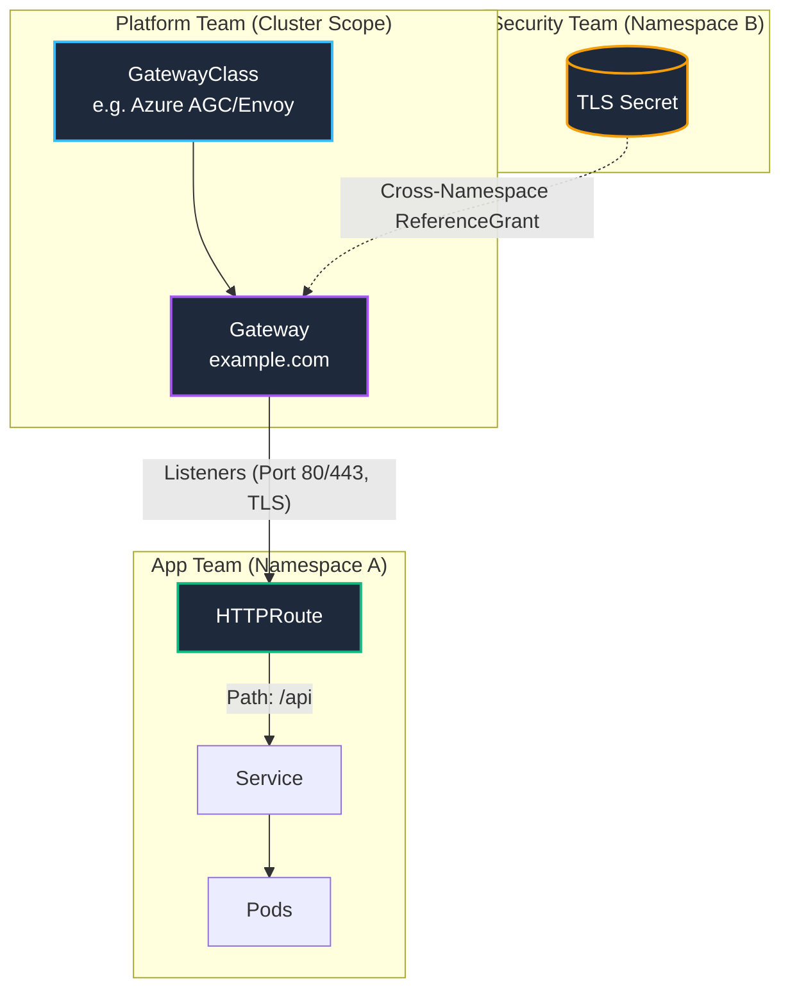

# 🌩️ Session 1: Kubernetes Gateway API vs Ingress

> **Source:** Gateway API Sprint - Video 1 (Kubernetes Gateway API - Is Ingress dead?)
> **Domain:** Kubernetes Orchestration & Networking

---

## 🧠 The Why: Why is Ingress "Dead"?

For years, **Ingress** was the standard way to expose Kubernetes pods to the outside world (Domain with TLS → Azure Load Balancer → Ingress → Service → Pods). It provided a single entry point, better routing options than `LoadBalancer` types, and TLS termination via tools like `cert-manager`.

However, Ingress reached its limits in modern enterprise environments:
- **Vendor Lock-in (The "Annotation Soup"):** Ingress controllers (Traefik, NGINX, Azure AGIC) route traffic differently. Engineers rely on vendor-specific annotations (e.g., `nginx.ingress.kubernetes.io/use-regex: "true"`), making it impossible to migrate controllers without entirely rewriting manifests.
- **Strict Namespace Boundaries:** TLS secrets and Ingress rules *must* reside in the exact same namespace as the target pods. Secure cross-namespace routing is not natively supported.
- **Lack of Advanced Traffic Policy:** Native Ingress lacks complex capabilities like weighted load balancing, header-based routing, or protocol support beyond HTTP/HTTPS (e.g., TCP/UDP).

**The Solution:** The **Gateway API** — a modular, extensible, and role-oriented standard built directly into Kubernetes to solve these exact problems.

---

## 🏛️ Architecture: Gateway API Topology

Unlike the monolithic `Ingress` object, the Gateway API breaks routing down into modular components. This allows different roles (Platform/Infra teams vs. App Developers) to manage their respective configurations safely across different namespaces.



### Core Components
1. **GatewayClass:** Defines which underlying proxy/infrastructure will fulfill the gateway (similar to `IngressClass`).
2. **Gateway:** Represents the physical/logical load balancer. It contains **Listeners** (monitoring specific ports and protocols like HTTP, HTTPS, TLS, TCP, UDP) and governs TLS certificates.
3. **HTTPRoute (or TCPRoute/UDPRoute):** Configured by application owners to define allowed paths, headers, backend services, and advanced traffic rules like **weighted load balancing** or **canary releases**.

---

## 💻 Execution: The Shift in YAML

### ❌ The Legacy Way (Ingress)
*Notice the heavy use of proprietary annotations locking the application to NGINX, and the requirement of two completely different resources.*

**1. The Ingress Controller (LoadBalancer)**
```yaml
kind: Service
apiVersion: v1
metadata:
  name: ingress-nginx-controller
  namespace: ingress-basic
  labels:
    app.kubernetes.io/component: controller
    app.kubernetes.io/instance: ingress-nginx
    app.kubernetes.io/managed-by: Helm
    app.kubernetes.io/name: ingress-nginx
    app.kubernetes.io/part-of: ingress-nginx
  annotations:
    service.beta.kubernetes.io/azure-load-balancer-health-probe-request-path: /healthz
spec:
  ports:
    - name: http
      port: 80
      targetPort: http
    - name: https
      port: 443
      targetPort: https
  selector:
    app.kubernetes.io/name: ingress-nginx
  type: LoadBalancer
  externalTrafficPolicy: Local
status:
  loadBalancer:
    ingress:
      - ip: 52.139.6.71
```

**2. The Ingress Route**
```yaml
kind: Ingress
apiVersion: networking.k8s.io/v1
metadata:
  name: customerapi-prod
  namespace: customerapi-prod
  annotations:
    cert-manager.io/cluster-issuer: letsencrypt
    kubernetes.io/ingress.class: nginx
    nginx.ingress.kubernetes.io/use-regex: 'true' # ⚠️ Vendor Lock-in!
spec:
  tls:
    - hosts: [customer.programmingwithwolfgang.com]
      secretName: customerapi-tls # ⚠️ Must be in the exact same namespace
  rules:
    - host: customer.programmingwithwolfgang.com
      http:
        paths:
          - path: /
            pathType: Prefix
            backend:
              service: { name: customerapi, port: { number: 80 } }
```

### ✅ The Modern Way (Gateway API)
*Going forward, routing is split into a physical `Gateway` (managed by Infra) and an `HTTPRoute` (managed by Devs).*

**1. The Gateway (Platform/Infra Team)**
*Notice how listeners for HTTP/HTTPS are centralized globally.*
```yaml
apiVersion: gateway.networking.k8s.io/v1 # Defines the standard Gateway API
kind: Gateway # The physical or logical load balancer managed by the Infra team
metadata:
  name: $GatewayName
  namespace: $InfrastructureNamespace # Crucial: Gateways live in a central Infra/Ops namespace
  annotations:
    # Vendor-specific provisioning annotations exist ONLY here, hiding them from developers
    alb.networking.azure.io/alb-namespace: $InfrastructureNamespace
    alb.networking.azure.io/alb-name: $ApplicationLoadBalancerName
    # Tells Cert-Manager to secure these endpoints automatically
    cert-manager.io/cluster-issuer: $ClusterIssuerName
spec:
  # Defines the actual controller building the infrastructure (e.g., Azure AGC, Envoy)
  gatewayClassName: $GatewayClassName
  listeners:
  
  # Listener 1: Standard HTTP Traffic (Catch-all)
  - name: http-listener
    port: 80
    protocol: HTTP
    allowedRoutes: # Security boundary: Who is permitted to attach routes to this Gateway?
      namespaces:
        from: All # In prod, this is usually restricted to specific namespaces (e.g., 'Selector')
        
  # Listener 2: Traefik specific HTTPS Traffic
  - name: traefik-https-listener
    port: 443
    protocol: HTTPS
    hostname: $TraefikUrl # Listens specifically on this subdomain/SNI
    tls: # Centralized TLS Management! Devs don't need to mount certs in their apps.
      certificateRefs:
        - group: ""
          kind: Secret
          name: $TraefikSecretName
          namespace: $InfrastructureNamespace
    allowedRoutes:
      namespaces:
        from: All
        
  # Listener 3: NGINX specific HTTPS Traffic
  - name: nginx-https-listener
    port: 443
    protocol: HTTPS
    hostname: $NginxUrl
    tls:
      certificateRefs:
        - group: ""
          kind: Secret
          name: $NginxSecretName
          namespace: $InfrastructureNamespace
    allowedRoutes:
      namespaces:
        from: All
```

**2. The HTTPRoute (Application Dev Team)**
*Notice how developers can elegantly match on paths and specific headers without writing vendor-specific annotations!*
```yaml
apiVersion: gateway.networking.k8s.io/v1
kind: HTTPRoute # A developer-owned object defining how traffic reaches their application
metadata:
  name: $RoutingHttpRoute
  namespace: $RoutingDemoNamespace # Deployed directly alongside the application pods
spec:
  parentRefs:
    # Binds this route to the central Gateway managed by the Infra team
    - name: $GatewayName
      namespace: $InfrastructureNamespace # Cross-namespace attachment natively supported
      
  rules:
    # Rule 1: Standard Path-Based Routing
    - matches:
        - path:
            type: PathPrefix
            value: /routing # If traffic hits example.com/routing...
      backendRefs:
        # ...send it to this Kubernetes Service inside the app namespace on port 80
        - name: $RoutingAppNameOne
          port: 80
          
    # Rule 2: Advanced Header-Based Routing (Perfect for Canary/A-B Testing)
    - matches:
        # If traffic hits /routing AND has the exact HTTP header 'header: routing'...
        - headers:
          - type: Exact
            name: header
            value: routing 
          path:
            type: PathPrefix
            value: /routing
      backendRefs:
        # ...send it to Service Two instead! (Zero vendor annotations required)
        - name: $RoutingAppNameTwo
          port: 80
```

---

## ⚠️ Production Gotchas & Interview Traps

*   **Interview Trap:** *"Why can't we just use Ingress for TCP traffic?"*
    *   **Answer:** Native Ingress is strictly designed for Layer 7 HTTP/HTTPS traffic. To route raw TCP/UDP, you usually have to hack the NGINX ConfigMap directly. Gateway API fixes this natively using `TCPRoute` and `UDPRoute`.
*   **Gotcha:** **Cross-Namespace Secrets.** In traditional Ingress, if you generate a wildcard cert via Cert-Manager in the `security` namespace, you cannot natively use it in the `frontend` namespace. Gateway API introduces **`ReferenceGrant`**, explicitly allowing a Gateway in Namespace A to safely consume a TLS Secret in Namespace B.
*   **Advanced Capabilities:** Native mTLS configuration, weighted load balancing (traffic splitting), and header manipulation are built directly into the Gateway API route specifications without requiring vendor-specific annotation hacks.
