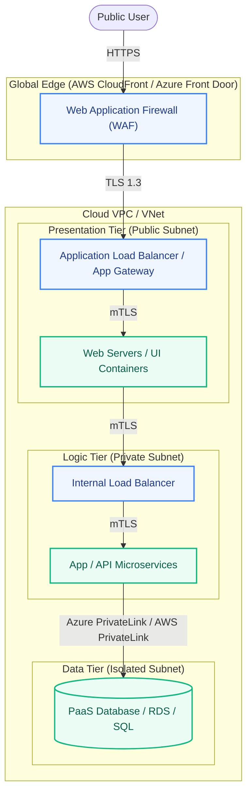

# 🛡️ Zero-Trust Architecture: 3-Tier Application (AWS / Azure)

**Core Principle:** *Never Trust, Always Verify.* 
In a Zero-Trust architecture, perimeter defense (like a single firewall) is considered obsolete. Every component must independently authenticate, authorize, and encrypt traffic, assuming the network is already compromised.

---

## 📐 Architecture Diagram Flow

---

## ⚙️ Component Breakdown

### 1. Web Application Firewall (WAF)
* **Location:** Deployed at the absolute Edge (AWS CloudFront / Azure Front Door) or on the public-facing Application Load Balancer.
* **Zero-Trust Role:** Acts as the first line of defense. It inspects Layer 7 (HTTP/HTTPS) traffic for malicious payloads (SQLi, XSS, rate-limiting) *before* traffic ever enters your VPC/VNet. It verifies the *intent* of the payload.

### 2. Default-Deny Security Groups (AWS SG / Azure NSG)
* **Location:** Applied to every single resource (Load Balancers, EC2/VMs, AKS nodes, Database endpoints).
* **Zero-Trust Role:** 
  - Every SG/NSG must implicitly drop all traffic (`0.0.0.0/0 Deny`).
  - **Web Tier SGs:** Only allow Inbound Port 443 from the WAF/Edge IP ranges.
  - **App Tier SGs:** Only allow Inbound Port 443 strictly from the Web Tier's specific Security Group ID (do not use CIDR blocks).
  - **Data Tier SGs:** Only allow DB ports (e.g., 3306) strictly from the App Tier SG.

### 3. Mutual TLS (mTLS)
* **Location:** Service-to-Service communication (usually managed by a Service Mesh like Istio or Linkerd) between the Web and App tiers.
* **Zero-Trust Role:** Standard TLS only verifies the server to the client. **Mutual TLS** requires both the Client (Web Server) and the Server (App Server) to present cryptographic certificates to each other. Even if a hacker breaches the Web Subnet, they cannot talk to the App Subnet without holding the exact cryptographic private key distributed by your internal Certificate Authority.

### 4. PrivateLink (AWS PrivateLink / Azure Private Link)
* **Location:** Bridge between the Application Tier and the PaaS Data Tier (RDS, CosmosDB, Azure SQL).
* **Zero-Trust Role:** Normally, connecting to a managed Cloud Database routes traffic over the public internet backbone. PrivateLink drops a virtual Network Interface (ENI/NIC) directly into your private subnet. 
  - Traffic never traverses the public internet.
  - The database firewall is locked down to exclusively allow traffic from that specific Private Endpoint, creating a dark, invisible tunnel for your data.
