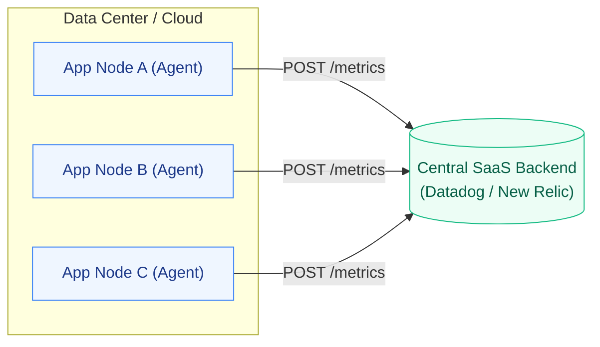
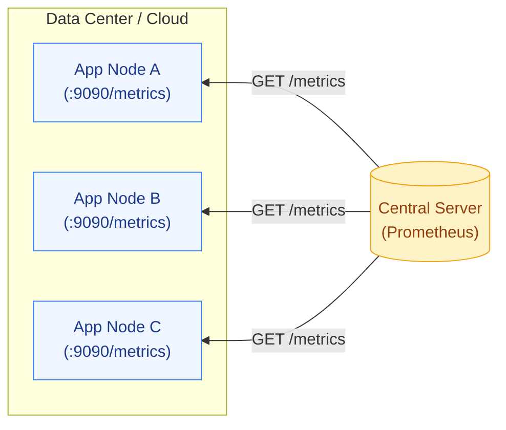

# 📊 Observability Topologies: Pull (Prometheus) vs. Push (Datadog)

When designing an enterprise observability stack, the most fundamental architectural decision is how metrics travel from your application to the central monitoring server. 

There are two primary paradigms: **Pull-based** (e.g., Prometheus) and **Push-based** (e.g., Datadog, New Relic, Dynatrace).

---

## 📡 1. Push-Based Architecture (Datadog / New Relic)

In a Push model, your application or a local agent actively sends (pushes) telemetry data outbound to the central monitoring server.

### 📐 Architecture Flow

### Key Technical Characteristics:
1. **Network Topology:** The Nodes require **Outbound** network access to the monitoring server. They do not require any Inbound ports to be opened. 
2. **Ephemeral Lifespans:** Highly compatible with serverless (AWS Lambda) or short-lived batch jobs. If a container lives for 5 seconds, it can push its metrics before dying.
3. **Decentralized Configuration:** The central server is "dumb." It doesn't know who is sending it data until the data arrives. The agents themselves hold the configuration for what to monitor and where to send it.

---

## 🧲 2. Pull-Based Architecture (Prometheus)

In a Pull model, the central monitoring server (Prometheus) actively reaches out and "scrapes" metrics from an exposed HTTP endpoint (usually `:9090/metrics`) on your application.

### 📐 Architecture Flow

### Key Technical Characteristics:
1. **Network Topology:** The Nodes require **Inbound** network access. The Prometheus server must be able to resolve the IP address of every node and connect to it over the network.
2. **Service Discovery is Mandatory:** Because Prometheus has to reach out to the nodes, it must integrate deeply with the environment's control plane (like the Kubernetes API) to dynamically discover the IPs of thousands of constantly shifting Pods.
3. **Centralized Configuration:** The nodes are "dumb." They just expose their current state on a `/metrics` webpage. Prometheus holds all the configuration regarding *who* to scrape and *how often* to scrape.
4. **Overload Protection:** A struggling application won't accidentally DDoS the central logging server by pushing millions of error logs. Prometheus controls the cadence (e.g., scraping strictly every 15 seconds).

---

## 🥊 Interview Cheat Sheet: The "Why?"

If an interviewer asks you which one to pick, use this matrix:

| Scenario | Winner | Why? |
| :--- | :---: | :--- |
| **Short-Lived / Serverless Jobs** | **Push (Datadog)** | A Lambda function might run for 2 seconds. Prometheus won't have time to scrape it before it dies. |
| **Highly Secure Restricted VPCs** | **Push (Datadog)** | Security teams prefer Outbound-only traffic. Opening Inbound ports to every server for Prometheus scraping causes friction in banking/Zero-Trust setups. |
| **Kubernetes (Native)** | **Pull (Prometheus)** | Prometheus talks natively to the Kube-API. When a Pod spins up, Prometheus instantly dynamically discovers its IP and scrapes it. No agent required. |
| **Troubleshooting & Overload** | **Pull (Prometheus)** | If a node is crashing, it might not have the CPU available to push metrics. With Prometheus, you can manually `curl http://node-ip:9090/metrics` from your laptop to see exactly what Prometheus sees to debug the crash. |
