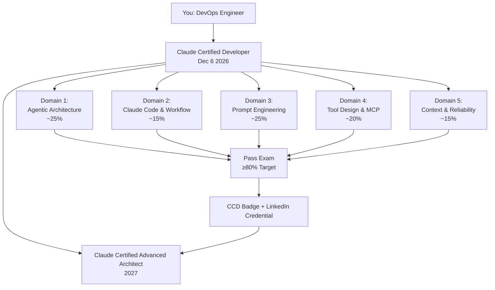

# 📘 Week 01 — Claude Certification Landscape & Exam Blueprint

> **Study Date:** Sep 19–20, 2026 | **Target:** Claude Certified Developer Foundation (Dec 6, 2026)

---

## 🎯 The "Why" (Core Concept & Analogy)

- **Problem Statement:** The industry lacks a standardized benchmark for validating genuine AI Platform Engineering skill — separating engineers who can *call* the Claude API from those who can *architect* production-grade agentic systems at Principal level.
- **DevOps Analogy:** Think of Claude Certifications like the **CKA vs CKAD split**. The *Developer* cert proves you can build and deploy workloads correctly; the *Architect* cert proves you can design the cluster topology itself at scale. Same concept — different abstraction layer.
- **One-liner exam definition:** Claude Certifications validate engineering competency across the **full agentic stack** — from raw API mechanics to multi-agent orchestration, prompt engineering, and production reliability.

---

## 🏗️ Architecture & Certification Track Structure

### Track 1: Claude Certified Developer (CCD) — YOUR TARGET
| Field | Details |
|---|---|
| **Target Audience** | Software engineers, AI application developers, DevOps/Platform engineers building Claude-powered systems |
| **Core Focus** | Hands-on API usage, SDK integration, tool design, prompt engineering, agentic workflows |
| **Exam Format** | Multiple choice + scenario-based questions |
| **Duration** | ~90 minutes |
| **Passing Mark** | ~70% (not officially confirmed — treat 80%+ as your personal target) |
| **Exam Date Target** | **December 6, 2026** |
| **Primary Resource** | [Anthropic Docs](https://docs.anthropic.com) + Official 12-episode YouTube build-along |
| **Mock Exam** | Anthropic Certification Portal (available closer to launch) |

### Track 2: Claude Certified Advanced Architect (CCAA)
| Field | Details |
|---|---|
| **Target Audience** | Principal Engineers, AI Architects, Technical Leads designing enterprise-scale agentic systems |
| **Core Focus** | Multi-agent coordination, security architecture, cost optimization at scale, MCP ecosystem design |
| **Exam Format** | Scenario-based architecture design questions + technical deep-dives |
| **Duration** | ~120 minutes |
| **Passing Mark** | ~75% (treat 85%+ as your personal target) |
| **Prerequisite** | Claude Certified Developer recommended first |
| **Primary Resource** | Anthropic Architecture Whitepapers + Cookbook |

---

### 📋 CCD Exam Domain Coverage (What Will Be Tested)

```
┌─────────────────────────────────────────────────────────┐
│           Claude Certified Developer — 5 Domains         │
├──────────────────────────────────┬──────────────────────┤
│ Domain                           │ Estimated Weight     │
├──────────────────────────────────┼──────────────────────┤
│ Agentic Architecture &           │ ~25%                 │
│ Orchestration                    │                      │
├──────────────────────────────────┼──────────────────────┤
│ Claude Code Configuration        │ ~15%                 │
│ & Workflow                       │                      │
├──────────────────────────────────┼──────────────────────┤
│ Prompt Engineering &             │ ~25%                 │
│ Structured Output                │                      │
├──────────────────────────────────┼──────────────────────┤
│ Tool Design & MCP Integration    │ ~20%                 │
│                                  │                      │
├──────────────────────────────────┼──────────────────────┤
│ Context Management & Reliability │ ~15%                 │
│                                  │                      │
└──────────────────────────────────┴──────────────────────┘
```

---

### Mermaid — Certification Progression Path



---

## 💻 Essential Execution (SDK & API)

### Python SDK — First API Call Pattern (Baseline for ALL future topics)
```python
import anthropic
import os

# Initialize the client — reads ANTHROPIC_API_KEY from environment variable
# NEVER hardcode your API key. Use env vars or a secrets manager (Azure KV, AWS SSM)
client = anthropic.Anthropic()

# The core object: client.messages.create()
# This is the ONLY endpoint you need for 90% of the exam scenarios
response = client.messages.create(
    model="claude-opus-4-5",      # Model selection matters for cost/speed tradeoffs
                                  # Haiku=cheapest/fastest, Opus=most capable
    max_tokens=1024,              # REQUIRED field — Claude will NOT default this
                                  # ⚠️ Exam trap: forgetting max_tokens = ValidationError
    system="You are a helpful AI assistant.",  # Top-level system param
                                               # NOT inside messages[] like OpenAI
    messages=[
        {
            "role": "user",
            "content": "Explain the Claude certification tracks in one sentence."
        }
    ]
)

# ⚠️ Exam trap: response is NOT a plain string
# You must access: response.content[0].text
print(response.content[0].text)

# Key response fields to know:
print(response.stop_reason)       # "end_turn" | "max_tokens" | "tool_use" | "stop_sequence"
print(response.usage.input_tokens)   # Tokens charged for your input
print(response.usage.output_tokens)  # Tokens charged for Claude's response
print(response.model)             # Actual model used (may differ if aliased)
```

### cURL (Secondary — for exam scenario awareness)
```bash
curl https://api.anthropic.com/v1/messages \
  -H "x-api-key: $ANTHROPIC_API_KEY" \
  -H "anthropic-version: 2023-06-01" \
  -H "content-type: application/json" \
  -d '{
    "model": "claude-opus-4-5",
    "max_tokens": 1024,
    "messages": [
      {"role": "user", "content": "Explain Claude certifications."}
    ]
  }'
```

---

## 📊 Key Parameters & Response Fields (Exam Reference Table)

| Parameter / Field | Type | Purpose | Exam Trap? |
|---|---|---|---|
| `model` | string | Selects the Claude model. Use `claude-opus-4-5` for quality, `claude-haiku-4-5` for cost | ⚠️ Yes — model aliases can cause unexpected billing |
| `max_tokens` | int | **Required.** Hard cap on output tokens. No default exists | ⚠️ Yes — most common ValidationError for beginners |
| `system` | string | Top-level system prompt. **NOT** inside `messages[]` | ⚠️ Yes — OpenAI engineers get this wrong |
| `messages` | array | Turn-by-turn conversation history. Must alternate `user`/`assistant` | ⚠️ Yes — back-to-back same roles cause errors |
| `stop_reason` | string | `end_turn`=natural stop, `max_tokens`=truncated, `tool_use`=tool called | ⚠️ Yes — critical for agentic loop logic |
| `usage.input_tokens` | int | Tokens billed for your input including system prompt | ⚠️ Yes — system prompt tokens ARE billed |
| `usage.output_tokens` | int | Tokens billed for Claude's response | |
| `content[0].text` | string | Actual response text — must be indexed, not a plain string | ⚠️ Yes — raw response object is NOT a string |
| `anthropic-version` | header | API version pinning — required in every cURL call | ⚠️ Yes — missing this = 400 error |

---

## 🔬 Production Gotchas & Interview Traps

### ⚠️ Trap 1: `max_tokens` is NOT Optional
- **What breaks:** Your application throws a `BadRequestError: max_tokens is required` in production.
- **Why it breaks:** Unlike OpenAI's GPT, Claude's API **has no default value** for `max_tokens`. Every call must declare it explicitly.
- **SRE Fix:** Enforce `max_tokens` via a Pydantic model validator at the application layer so it fails fast at startup, not at runtime under load.

### ⚠️ Trap 2: System Prompt is NOT Inside `messages[]`
- **What breaks:** Engineers migrating from OpenAI pass `{"role": "system", "content": "..."}` inside the `messages` array. Claude rejects it.
- **Why it breaks:** Claude's API separates system instructions into a **top-level `system` parameter**, not a message role.
- **SRE Fix:** During PR review, enforce a linting rule that flags any `role: system` pattern inside the `messages` array.

### ⚠️ Trap 3: `response.content[0].text` vs `response` as a String
- **What breaks:** `print(response)` prints the full object. `response + " suffix"` throws a TypeError.
- **Why it breaks:** The API returns a `Message` object, not a raw string.
- **SRE Fix:** Always use `response.content[0].text`. Add a wrapper function `get_text(response)` across your codebase for consistent extraction.

### ⚠️ Trap 4: Developer vs Architect — Scope Confusion
- **What breaks:** Exam candidates study Architect-level topics (multi-cluster MCP, enterprise RBAC) for the Developer exam and waste revision time.
- **Why it breaks:** The two tracks have distinct, non-overlapping scope boundaries.
- **SRE Fix:** For the **CCD exam**, stay strictly within the 5 domains above. Architect-level concepts are out of scope.

---

## 🎤 Mock Interview Q&A (Principal Engineer Level)

**Q: What is the fundamental structural difference between Claude's Messages API and OpenAI's Chat Completions API regarding system prompts?**
> **SRE Answer:** Claude's API separates the system instruction into a **top-level `system` parameter** outside the `messages` array. OpenAI uses `{"role": "system"}` as the first element inside `messages`. This means any OpenAI migration must refactor all system prompt injection points — a common source of subtle bugs in LLM abstraction layers.

**Q: A junior engineer reports that their Claude API call works in testing but throws errors in production. You see `stop_reason: max_tokens` in 40% of responses. What is your diagnosis and fix?**
> **SRE Answer:** The `max_tokens` value is set too low for production payload sizes. The model is being truncated mid-response — especially dangerous in agentic workflows where a truncated tool call JSON causes downstream parsing failures. Fix: analyze the 95th percentile token usage in staging logs, set `max_tokens` to 2x that value, and add a circuit breaker that retries with higher `max_tokens` when `stop_reason == "max_tokens"`.

**Q: Which Claude model would you use for a high-volume, real-time classification microservice that needs to categorize 10,000 support tickets per hour at minimum cost?**
> **SRE Answer:** `claude-haiku-4-5` — it is Anthropic's fastest and most cost-efficient model, purpose-built for high-throughput, low-latency tasks like classification, routing, and triage where maximum intelligence isn't required.

---

## ⚡ 10-Second Exam Cheat Sheet
> Claude has **two certification tracks**: **Developer** (API, SDK, tools, prompts, agents) and **Advanced Architect** (enterprise design, multi-agent systems). For the Developer exam, the 5 core domains are: Agentic Architecture, Claude Code, Prompt Engineering, Tool/MCP Design, and Context Management. Every single API call requires `max_tokens` explicitly — there is no default — and the `system` prompt is a **top-level parameter**, never a role inside `messages[]`.
