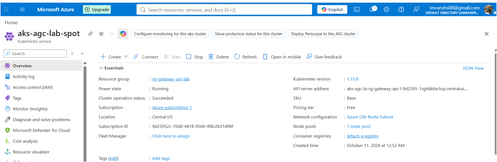
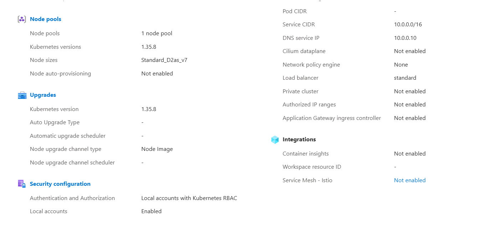
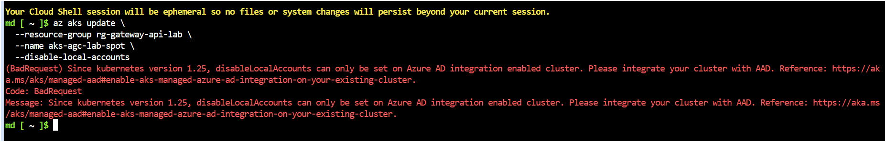
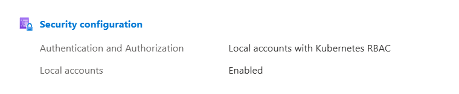
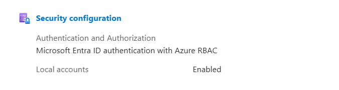
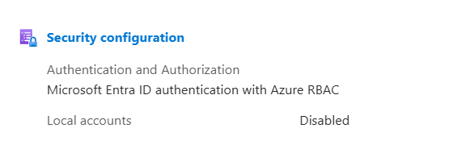

# 🔐 SRE Masterclass Sandbox: The Insider Threat (AKS Zero-Trust)

This lab is a cinematic, end-to-end execution guide demonstrating a classic "Insider Threat" scenario. We will simulate three distinct actors: a Senior Admin (`Alex`), an Insider Threat (`Imran Ahmad`), and an External Hacker (`saifi`). We will prove mathematically why AKS Local Accounts represent a critical backdoor, how credentials can be blindly copy-pasted, and how to permanently board up the API Server using Zero-Trust Architecture.

---

## 🎭 The Cast of Characters
* **The Architect (Alex):** `jamiaxpress@gmail.com`
* **The Insider Threat (Imran Ahmad):** `imranshs08@gmail.com`
* **The External Threat (Hacker):** `saifi` (Zero Azure Access)
* **The Target Workload:** A simple `nginx` deployment.

---

## 🎬 Act I: Provisioning & Onboarding

### Step 1 & 2: The Architect Deploys the Cluster (With The Backdoor)
Log into your local CLI as **`jamiaxpress@gmail.com`**. We will deploy a standard AKS cluster. By default, this enables Azure RBAC *and* inherently leaves the Local Accounts (static certificates) wide open.

> **Enterprise DO:** Always explicitly declare `--disable-local-accounts` during provisioning for production clusters.
> **Enterprise DON'T:** Never assume Entra ID integration automatically secures the API Server. It fundamentally does not.




```bash
# Define Constants
RG_NAME="rg-gateway-api-lab"
LOCATION="centralus"
CLUSTER_NAME="aks-agc-lab-spot"

# 1. Spin up the Resource Group
az group create --name "$RG_NAME" --location "$LOCATION"

# 1. Spin up the Resource Group
az group create --name "$RG_NAME" --location "$LOCATION"

# 2. Provision the Cluster (Local Accounts Enabled)
az aks create     --resource-group "$RG_NAME"     --name "$CLUSTER_NAME"     --node-count 1 --node-vm-size Standard_D4ds_v7     --generate-ssh-keys     --network-plugin azure     --enable-managed-identity     --enable-aad     --enable-azure-rbac

```

### Step 3 & 4: Inviting & Granting Permission to the Employee
The Architect (`Alex`) now invites the Employee (`Imran Ahmad`) to help manage the cluster.

> **Enterprise DO:** Assign permissions strictly via Entra ID Security Groups, rather than individual direct user mapping.
> **Enterprise DON'T:** Do not grant 'Cluster Admin' for trivial tasks; utilize granular Azure RBAC namespaces.

```bash
# 3. Get the Object ID of the Insider Threat User (Guest accounts require mail filtering)
EMP_EMAIL="imranshs08@gmail.com"
EMP_ID=$(az ad user list --filter "mail eq '$EMP_EMAIL'" --query "[0].id" -o tsv)

# 4. Grant the Employee 'Azure Kubernetes Service RBAC Cluster Admin' rights
SUB_ID=$(az account show --query id -o tsv)
az role assignment create \
  --role "Azure Kubernetes Service RBAC Cluster Admin" \
  --assignee-object-id $EMP_ID \
  --assignee-principal-type User \
  --scope /subscriptions/$SUB_ID/resourceGroups/$RG_NAME/providers/Microsoft.ContainerService/managedClusters/$CLUSTER_NAME
```

---

## 🎬 Act II: The Sabotage & Data Exfiltration

### Step 5: The Insider Steals the God-Key
The Employee (`Imran Ahmad`) intends to quit the company, but wants to maintain a backdoor. They sign into Azure CLI on their laptop and intentionally use the `--admin` flag to pull the raw, static RSA certificate instead of their Entra ID token!

```bash
# The Insider executes this on their terminal
az aks get-credentials --resource-group rg-gateway-api-lab --name aks-agc-lab-spot --admin --file insecure-kubeconfig

# Verify the compromised context has been downloaded
kubectl config current-context --kubeconfig insecure-kubeconfig
# Output will be: aks-agc-lab-spot-admin (They now hold the static God-Key!)
```

### 🧠 SRE Deep-Dive: The Exfiltration Vector
Before deployment, let's understand exactly *what* the Insider just stole. 

**How to Expose the Stolen Payload:**
By default, Kubernetes hides these certificates and output `REDACTED`. To force the raw cryptographic Base64 strings to render in your terminal, the Insider executes the `--raw` dump command:
```bash
kubectl config view --kubeconfig insecure-kubeconfig --raw
```

**Example of the Stolen Payload:**
```yaml
apiVersion: v1
clusters:
- cluster:
    certificate-authority-data: LS0tLS1... (Base64 CA)
    server: https://aks-agc-la-rg-...hcp.centralus.azmk8s.io:443
  name: aks-agc-lab-spot
contexts:
- context:
    cluster: aks-agc-lab-spot
    user: clusterAdmin_rg-gateway-api-lab_aks-agc-lab-spot
  name: aks-agc-lab-spot-admin
current-context: aks-agc-lab-spot-admin
kind: Config
users:
- name: clusterAdmin_rg-gateway-api-lab_aks-agc-lab-spot
  user:
    client-certificate-data: LS0tLS1C... (Base64 RSA Public Cert)
    client-key-data: LS0tLS1C... (Base64 RSA PRIVATE KEY - The God Key)
```

> **Enterprise Threat Vector (Copy/Paste Execution):** 
> Because this specific kubeconfig utilizes static certificates, it is completely decoupled from Azure Active Directory. The Insider can literally email or copy/paste this exact `.yaml` file to a completely external hacker (`saifi`). 

---

### Step 6 & 7: Deploying the Target Workload
Before executing the sabotage, we must deploy a production target. Any authenticated user (like the Architect) can run this:

**Create `nginx-deployment.yaml`:**
```yaml
apiVersion: apps/v1
kind: Deployment
metadata:
  name: nginx-web
  namespace: default
spec:
  replicas: 2
  selector:
    matchLabels:
      app: nginx
  template:
    metadata:
      labels:
        app: nginx
    spec:
      containers:
      - name: nginx
        image: nginx:latest
        ports:
        - containerPort: 80
```

```bash
# 6. Deploy Nginx
kubectl apply -f nginx-deployment.yaml

# 7. Validate via Port-Forward
kubectl port-forward deployment/nginx-web 8080:80
```

---

## 🎬 Act III: Termination & The Hacker Strike

### Step 8: The Architect Fires the Employee
The Architect (`Alex`) terminates `Imran Ahmad` and revokes their Azure access entirely from the portal.

```bash
# The Architect revokes the Azure RBAC assignment
az role assignment delete \
  --role "Azure Kubernetes Service RBAC Cluster Admin" \
  --assignee $EMP_ID \
  --scope /subscriptions/$SUB_ID/resourceGroups/$RG_NAME/providers/Microsoft.ContainerService/managedClusters/$CLUSTER_NAME
```

### Step 9: The Copy/Paste Hacker Execution (Saifi Strikes)
In retaliation, the fired employee sends the `insecure-kubeconfig` text file to the External Hacker (**`saifi`**). 

`Saifi` does not have an Azure account, has never run `az login`, and does not have any Microsoft credentials. He operates blindly from a remote machine.

`Saifi` saves the file locally and runs the execution commands:
```powershell
# Hacker (saifi) mechanically binds the stolen text file to his terminal
export KUBECONFIG=insecure-kubeconfig

# Hacker strikes the cluster (Bypassing Azure AD entirely)
kubectl delete -f nginx-deployment.yaml
```
**💥 Result:** `deployment.apps "nginx-web" deleted.` 
Even though the employee was fired from Azure, the static God-Key was successfully blindly copy/pasted to an exogenous threat actor (`saifi`), who murdered the production workload!

---

## 🎬 Act IV: The Zero-Trust Remediation

### Step 10: The Architect Seals the Breach
The Architect realizes they left the API Server exposed to local certificate bypassing. They must immediately deploy Zero-Trust remediation.

> **Enterprise Warning (Blast Radius):** Running this command will break any Jenkins or GitHub pipelines still utilizing `--admin`. They must be migrated to Azure Service Principals via `kubelogin`.
>
> ⚠️ **Dependency Trap (v1.25 Lockout Safeguard):** Since Kubernetes version 1.25, Azure actively blocks the `--disable-local-accounts` command if the cluster is not already strictly bound to Azure AD. You must run the Prerequisite command first to link Entra ID, otherwise you will receive a `BadRequest` error.



*(Current configuration before remediation commands are executed):*


```bash
# PREREQUISITE: Force Azure AD & Azure RBAC Integration
az aks update \
  --resource-group rg-gateway-api-lab \
  --name aks-agc-lab-spot \
  --enable-aad \
  --enable-azure-rbac
```

*(After the prerequisite finishes, your cluster will show Microsoft Entra ID integration, but the Local Accounts backdoor remains "Enabled" and open):*



```bash
# The Architect universally destroys all Local Account certificates
az aks update \
  --resource-group rg-gateway-api-lab \
  --name aks-agc-lab-spot \
  --disable-local-accounts
```

### Step 11: The Re-Validation (Hacker Defeated)
The Hacker (`saifi`) attempts to launch a second attack using the exact same stolen local `kubeconfig` copy.

```powershell
# Hacker attempts to attack again using the same file
export KUBECONFIG=insecure-kubeconfig
kubectl get pods
```

**🛡️ Expected Output:** 
```text
error: You must be logged in to the server (Unauthorized)
```

*(Your final, Zero-Trust Architecture cluster configuration):*


**Victory!** 🎯 The API Server has permanently revoked trust in the static X.509 certificate. The only way to authenticate now is via a validated, real-time Azure Entra ID token, neutralizing the copy-paste vulnerability completely.

---

## 🧠 SRE Deep-Dive: The `az cli` vs `kubectl` Decoupling Principle
A common trap for junior engineers when validating this lab is discovering that running `kubectl get po -A` *still succeeds* locally even after they log out of Azure (`az logout`) or when `az account show` reports `No subscription found`. 

**Why does this happen architecturally?**
1. **Separation of State:** `kubectl` does **not** route its requests through the `az cli` session state. It fires HTTPS requests directly to the Kubernetes API Server using the authentication tokens embedded in your `~/.kube/config` file.
2. **Entra ID Token Caching:** When you authenticate with Azure AD, a cryptographic JWT (Access Token) is retrieved and cached locally (typically via `kubelogin`). The cluster API Server only validates the mathematical signature and lifespan of this JWT (which survives for 60-90 minutes independently of `az cli`). 
3. **Propagation Delay:** Disabling local accounts via ARM initiates a rolling restart of the Kubernetes Control Plane. It can take 3-5 minutes for the API Server nodes to bounce and drop the X.509 certificate validation module completely.

**To immediately break your local access and prove the lockout:** Delete your local token cache. The next `kubectl` command will then fail instantly!

```bash
# For Bash / Linux / Cloud Shell:
rm -rf ~/.kube/cache/kubelogin/

# For Windows PowerShell:
Remove-Item -Recurse -Force ~/.kube/cache/kubelogin/
```
